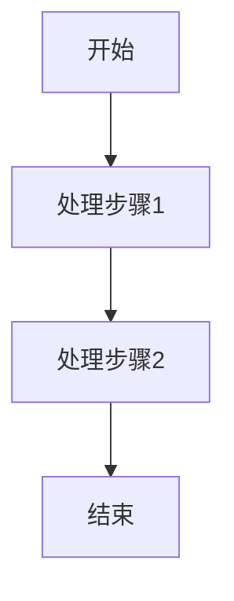
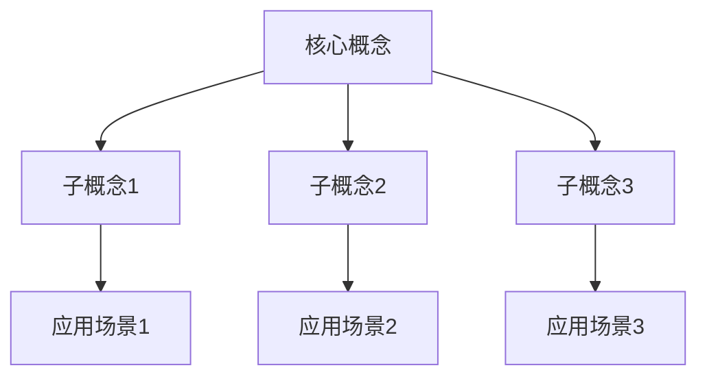

# [文章标题]

**文 | 三七** （转载请注明出处）  
**公众号：三七-编程实战**

### 🎨 封面图片提示词

<!-- 运行 python scripts/generate_cover_prompt.py 自动生成 -->

[待生成]

> **不积跬步无以至千里，欢迎来到AI时代的编码实战课**

## 📝 文章摘要

<!-- 运行 python scripts/generate_summary.py 自动生成 -->

[待生成]

---

## 一、场景引入

[用生动的现实场景引出问题，激发读者兴趣]

**开场方式**（选择一种）：

- 提问悬疑：以引发思考的问题开头
- 技术幽默：用轻松有趣的方式切入
- 案例关联：讲述一个真实的技术场景
- 开门见山：直接点明主题价值

---

## 二、概念引出 / 破俗立新

**科普型文章**：

- 自然引出核心技术概念
- 给出简明的定义
- 说明为什么需要这个技术

**问题解决型文章**：

- 挑战常见的认知误区
- 指出传统方法的不足
- 为新方法做铺垫

---

## 三、深度阐释

### 3.1 核心原理

[深入解释技术原理或方案细节]

### 3.2 工作机制

[说明技术的工作机制和流程]

**流程图示例**：



### 3.3 关键概念

[拆解和解释关键概念]

---

## 四、举一反三

### 4.1 基础应用示例

[简单场景下的应用]

```java
// 代码示例1：基础用法
public class Example1 {
    public void basicExample() {
        // 实现代码
    }
}
```

### 4.2 进阶应用示例

[复杂场景下的应用]

```java
// 代码示例2：进阶用法
public class Example2 {
    public void advancedExample() {
        // 实现代码
    }
}
```

### 4.3 综合应用示例

[实战场景下的应用]

```java
// 代码示例3：综合应用
public class Example3 {
    public void practicalExample() {
        // 实现代码
    }
}
```

### 4.4 方案对比

| 方案  | 优点 | 缺点 | 适用场景 |
| ----- | ---- | ---- | -------- |
| 方案A | ...  | ...  | ...      |
| 方案B | ...  | ...  | ...      |

### 4.5 效果对比

**使用前**：

- 性能指标1：X
- 性能指标2：Y

**使用后**：

- 性能指标1：X' （提升Z%）
- 性能指标2：Y' （提升Z%）

---

## 五、总结回顾

### 知识图谱



### 核心要点

1. **第一个要点**：简洁总结
2. **第二个要点**：简洁总结
3. **第三个要点**：简洁总结

### 如果今天你只记得一句话

> [用一句话概括文章的核心价值和独特洞察]

### 延伸阅读

1. [文章标题1](URL1) - 简要说明
2. [文章标题2](URL2) - 简要说明
3. [文章标题3](URL3) - 简要说明

---

**版权声明**：本文为原创文章，转载请注明出处。

**作者简介**：三七，专注于AI时代的编程实战分享。

**公众号**：三七-编程实战
