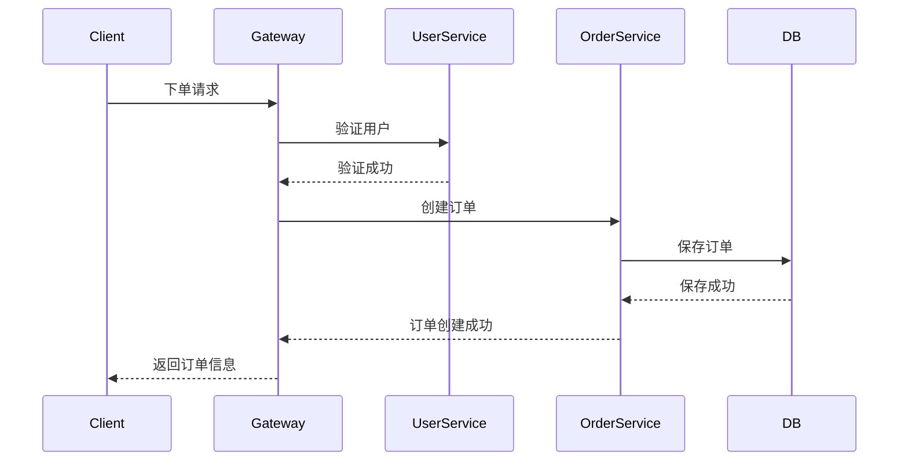
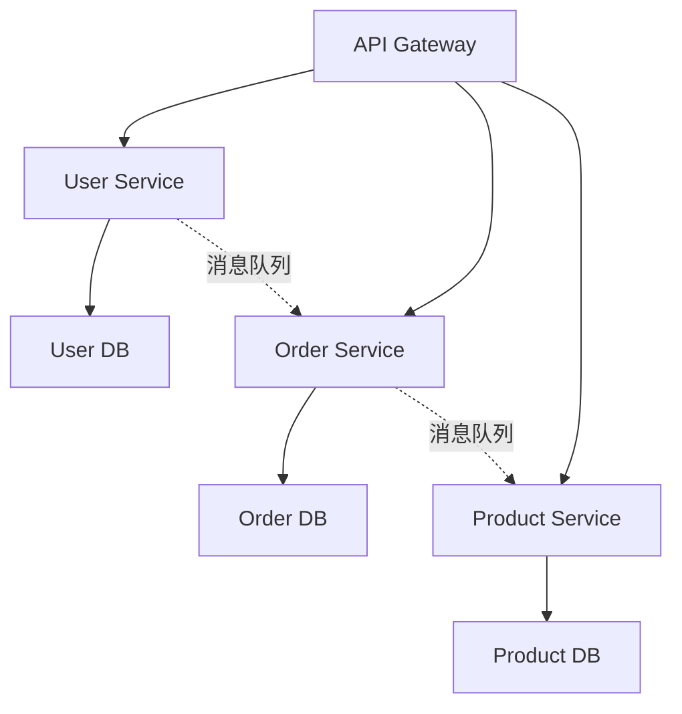
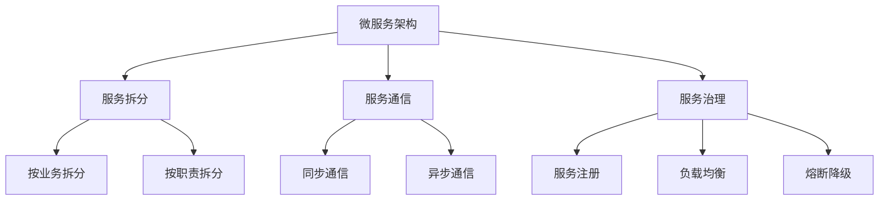
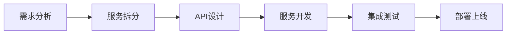

# 文章结构详细说明

## 黄金五段式结构详解

### 第一段：场景引入 (10%)

**目标**：用生动的现实场景引出问题，激发读者兴趣

#### 内容要求

1. **真实性**：场景必须真实可信
2. **相关性**：与主题紧密相关
3. **简洁性**：控制在文章的10%篇幅
4. **吸引力**：能够激发读者的好奇心

#### 四种开场方式

**方式1：提问悬疑**

通过引发思考的问题开头：

```markdown
为什么有些系统能轻松应对百万QPS，而有些系统在千级QPS就开始卡顿？

这背后的差距，往往不是硬件配置，而是架构设计。
```

**方式2：技术幽默**

用轻松有趣的方式切入：

```markdown
程序员的三大谎言：

1. 这个bug下周就修
2. 代码肯定没问题
3. 注释写得很清楚

今天我们聊聊第三个谎言——如何真正写出"清楚"的代码。
```

**方式3：案例关联**

讲述一个真实的技术场景：

```markdown
2020年某电商大促，凌晨2点，系统突然崩溃。
技术团队紧急排查，发现罪魁祸首竟然是一个看似无关紧要的缓存配置。
这次事故损失上千万，但更重要的教训是：细节决定成败。
```

**方式4：开门见山**

直接点明主题价值：

```markdown
Redis不仅仅是缓存，它是构建高性能系统的瑞士军刀。
本文将带你深入理解Redis的五大数据结构，以及它们在实战中的应用。
```

#### 常见错误

❌ **错误1：过度铺垫**

```markdown
计算机诞生于20世纪40年代，经过几十年的发展...
（花费大量篇幅讲历史，偏离主题）
```

❌ **错误2：抽象概念堆砌**

```markdown
在云计算、大数据、人工智能的时代背景下...
（开头过于抽象，缺少具体场景）
```

✅ **正确示例**：

```markdown
周五晚上，你的服务突然崩溃。日志显示：OutOfMemoryError。
这是每个Java开发者的噩梦。今天我们聊聊如何避免这个噩梦。
```

### 第二段：概念引出/破俗立新 (15%)

**目标**：根据文章类型，引出核心概念或挑战常见认知

#### 科普型文章：概念引出

**内容结构**：

1. 自然引出核心技术概念
2. 给出简明的定义
3. 说明为什么需要这个技术

**示例**：

```markdown
## 什么是微服务架构？

简单来说，微服务架构就是把一个大系统拆分成多个小服务。
每个服务独立部署、独立扩展、独立维护。

为什么需要微服务？
传统的单体应用就像一个大齿轮，任何部分出问题都会影响整体。
而微服务像乐高积木，每个积木都可以独立替换和升级。
```

#### 问题解决型文章：破俗立新

**内容结构**：

1. 挑战常见的认知误区
2. 指出传统方法的不足
3. 为新方法做铺垫

**示例**：

```markdown
## 缓存真的是银弹吗？

很多人认为：系统慢？加缓存！数据库压力大？加缓存！
但现实是，不恰当的缓存策略可能让问题更糟。

传统做法的三大问题：

1. 缓存穿透：恶意请求绕过缓存
2. 缓存雪崩：缓存集中失效
3. 缓存击穿：热点数据失效

今天我们聊聊如何正确使用缓存。
```

#### 关键技巧

**使用对比突出差异**：

```markdown
传统方法：

- 部署慢（需要重启整个应用）
- 扩展难（无法单独扩展某个功能）
- 影响大（一个bug可能导致全站崩溃）

微服务方法：

- 部署快（只需更新相关服务）
- 扩展易（可以只扩展瓶颈服务）
- 隔离好（单个服务故障不影响其他）
```

**用数据支撑观点**：

```markdown
根据ThoughtWorks的调查：

- 采用微服务的团队，部署频率提升10倍
- 平均故障恢复时间降低70%
- 开发效率提升40%
```

### 第三段：深度阐释 (20%)

**目标**：深入解释核心概念或方案

#### 内容组织

1. **技术原理**：如何工作的
2. **核心机制**：关键流程
3. **重要概念**：需要理解的术语

#### 认知台阶构建

**错误的演讲逻辑**（结论先行）：

```markdown
微服务架构很好用。（结论）
因为它可以独立部署、独立扩展。（论证）
```

**正确的听讲逻辑**（论证先行）：

```markdown
传统单体应用有什么问题？（问题）

- 部署慢：修改一行代码，需要重启整个应用
- 扩展难：某个功能负载高，只能扩展整个应用
- 风险大：一个bug可能导致全站崩溃

如何解决这些问题？（方案）

- 把大应用拆分成小服务
- 每个服务独立部署和扩展
- 服务之间通过API通信

这就是微服务架构。（结论）
```

#### 视觉辅助

**流程图示例**：



**架构图示例**：



#### 概念拆解

**复杂概念分层解释**：

```markdown
### 服务注册与发现

**第一层理解**：服务的"电话簿"

- 每个服务启动时，把自己的地址"登记"到注册中心
- 其他服务需要调用时，从注册中心"查询"地址

**第二层理解**：动态路由机制

- 服务实例可以随时增加或减少
- 注册中心自动更新服务列表
- 调用方自动感知变化

**第三层理解**：健康检查与故障转移

- 注册中心定期检查服务健康状态
- 不健康的实例自动从列表移除
- 调用方自动切换到健康实例
```

### 第四段：举一反三 (45%)

**目标**：通过多个实例深化理解

#### 内容结构

1. **基础应用示例**（简单场景）
2. **进阶应用示例**（复杂场景）
3. **综合应用示例**（实战场景）
4. **对比分析**（与其他方案对比）
5. **效果对比**（使用前后对比）

#### 代码示例要求

**基础示例**：

```java
/**
 * 示例1：最简单的用户服务
 * 目标：演示服务的基本结构
 */
@RestController
@RequestMapping("/users")
public class UserController {

    @Autowired
    private UserService userService;

    /**
     * 获取用户信息
     * 最基础的GET请求示例
     */
    @GetMapping("/{id}")
    public User getUser(@PathVariable Long id) {
        return userService.findById(id);
    }
}
```

**进阶示例**：

```java
/**
 * 示例2：带缓存的用户服务
 * 目标：演示如何集成缓存
 */
@Service
public class UserService {

    @Autowired
    private UserRepository userRepository;

    @Autowired
    private RedisTemplate<String, User> redisTemplate;

    /**
     * 获取用户信息（带缓存）
     * 先查缓存，缓存不存在再查数据库
     */
    public User findById(Long id) {
        // 1. 尝试从缓存获取
        String cacheKey = "user:" + id;
        User user = redisTemplate.opsForValue().get(cacheKey);

        if (user != null) {
            return user;  // 缓存命中
        }

        // 2. 缓存未命中，查询数据库
        user = userRepository.findById(id).orElse(null);

        // 3. 写入缓存
        if (user != null) {
            redisTemplate.opsForValue().set(cacheKey, user, 1, TimeUnit.HOURS);
        }

        return user;
    }
}
```

**综合示例**：

```java
/**
 * 示例3：完整的用户服务（带异常处理、日志、监控）
 * 目标：展示生产级别的代码
 */
@Service
@Slf4j
public class UserService {

    @Autowired
    private UserRepository userRepository;

    @Autowired
    private RedisTemplate<String, User> redisTemplate;

    @Autowired
    private MeterRegistry meterRegistry;

    /**
     * 获取用户信息（生产级别）
     */
    public User findById(Long id) {
        // 记录方法调用
        Timer.Sample sample = Timer.start(meterRegistry);

        try {
            // 1. 参数校验
            if (id == null || id <= 0) {
                log.warn("无效的用户ID: {}", id);
                throw new IllegalArgumentException("用户ID无效");
            }

            // 2. 查询缓存
            String cacheKey = "user:" + id;
            User user = redisTemplate.opsForValue().get(cacheKey);

            if (user != null) {
                log.debug("缓存命中: userId={}", id);
                meterRegistry.counter("user.cache.hit").increment();
                return user;
            }

            // 3. 查询数据库
            log.debug("缓存未命中，查询数据库: userId={}", id);
            meterRegistry.counter("user.cache.miss").increment();

            user = userRepository.findById(id)
                .orElseThrow(() -> new UserNotFoundException("用户不存在: " + id));

            // 4. 写入缓存
            redisTemplate.opsForValue().set(cacheKey, user, 1, TimeUnit.HOURS);

            return user;

        } catch (Exception e) {
            log.error("获取用户信息失败: userId={}", id, e);
            throw e;
        } finally {
            // 记录执行时间
            sample.stop(meterRegistry.timer("user.findById"));
        }
    }
}
```

#### 对比分析

**方案对比表格**：

| 特性     | 单体架构 | 微服务架构 | 服务网格 |
| -------- | -------- | ---------- | -------- |
| 复杂度   | 低       | 中         | 高       |
| 部署速度 | 慢       | 快         | 快       |
| 扩展性   | 差       | 好         | 优       |
| 运维成本 | 低       | 中         | 高       |
| 适用规模 | 小型项目 | 中大型项目 | 大型项目 |

**性能对比**：

```markdown
### 实际测试数据

**测试环境**：

- 机器配置：8核16G
- 并发用户：1000
- 测试时长：10分钟

**单体架构**：

- QPS：500
- 响应时间：200ms
- 错误率：5%

**微服务架构**：

- QPS：2000
- 响应时间：50ms
- 错误率：0.1%

**性能提升**：

- QPS提升400%
- 响应时间降低75%
- 可用性提升99%
```

### 第五段：总结回顾 (10%)

**目标**：提炼核心要点，加深印象

#### 必备元素

1. **知识图谱**：可视化核心概念关系
2. **核心要点**：3-5个关键点
3. **一句话精华**：高度概括
4. **延伸阅读**：3-5篇权威文章

#### 知识图谱设计

**类型1：概念关系图**：



**类型2：流程图**：



#### 核心要点提炼

```markdown
### 核心要点

1. **服务拆分原则**：单一职责、高内聚低耦合、独立部署
2. **通信方式选择**：同步用HTTP/gRPC，异步用消息队列
3. **数据一致性**：采用最终一致性，避免分布式事务
4. **服务治理**：服务注册、负载均衡、熔断降级缺一不可
5. **监控告警**：全链路追踪、日志聚合、指标监控
```

#### 一句话精华

**要求**：

- 高度概括核心价值
- 易于记忆和传播
- 体现独特洞察

**示例**：

```markdown
### 如果今天你只记得一句话

> 微服务不是银弹，它用复杂度换灵活性。
> 只有当你的团队规模和业务复杂度达到一定程度，微服务才是最优选择。
```

#### 延伸阅读

```markdown
### 延伸阅读

1. [Martin Fowler - Microservices](https://martinfowler.com/articles/microservices.html) - 微服务架构的权威定义
2. [Netflix - Building Microservices](https://netflixtechblog.com/) - Netflix的微服务实践
3. [Chris Richardson - Microservice Patterns](https://microservices.io/) - 微服务设计模式
4. [Sam Newman - Building Microservices](https://samnewman.io/) - 微服务构建指南
5. [云原生应用架构](https://www.cnpatterns.org/) - 云原生微服务模式
```

## 完整文章示例

[参考 assets/article-template.md]
