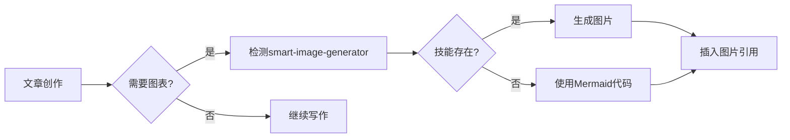
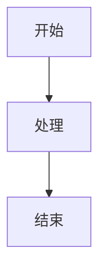

# 绘图技能集成说明

## 概述

tech-article-writer技能集成了`smart-image-generator`技能，用于自动生成文章中的流程图、架构图等可视化内容。

## 集成机制

### 自动检测

当文章创作过程中需要绘制可视化内容时，系统会：

1. **检测技能存在性**：自动查找`smart-image-generator`技能
2. **评估调用必要性**：判断是使用Mermaid/PlantUML代码还是生成图片
3. **选择最佳方案**：
   - 简单流程图 → Mermaid代码（快速、可编辑）
   - 复杂架构图 → 生成图片（美观、专业）
   - 思维导图 → 生成图片（视觉效果好）
   - 时序图 → Mermaid代码（标准、清晰）

### 存储结构

```
.tech-article-writer/
├── sessions/              # 会话记录
├── images/                # 生成的图片
│   ├── flowchart-*.png
│   ├── architecture-*.png
│   └── mindmap-*.png
└── diagrams/              # 图表提示词（可选）
    └── *.md
```

## 使用场景

### 场景1：创作时自动生成

**触发条件**：AI判断需要可视化展示

**工作流程**：



**示例对话**：

```
用户: 请创作一篇关于微服务架构的文章

AI: 好的，我会创作一篇关于微服务架构的文章。
    在第三部分"深度阐释"中，我会添加微服务架构图。
    检测到smart-image-generator技能存在，
    我将生成一张专业的架构图。

[生成文章...]

第三部分插入:

```

### 场景2：批量转换现有文章

**触发条件**：用户明确请求转换

**使用命令**：

```bash
python scripts/convert_diagrams.py --article-file article.md [--keep-original]
```

**工作流程**：

1. 扫描文章中的所有Mermaid/PlantUML代码块
2. 检测smart-image-generator技能
3. 逐个转换为图片
4. 替换代码块为图片引用
5. 可选：在注释中保留原始代码

**示例**：

````markdown
转换前:


````

转换后:


<!-- 原始mermaid代码：

-->
```

### 场景3：指定图表类型生成

**触发条件**：用户明确请求特定类型的图

**示例对话**：

```
用户: 请在文章中添加一个思维导图，展示微服务的核心概念

AI: 好的，我将使用smart-image-generator技能生成一张思维导图。

[调用技能生成图片...]

已生成: .tech-article-writer/images/mindmap-microservices-concepts-20240129-1430.png

[在文章中插入:]

```

## 技能调用接口

### 智能检测技能位置

系统会自动智能搜索`smart-image-generator`技能，支持多种安装位置：

#### 检测顺序

1. **用户级（User-level）**
   - `~/.cursor/skills/smart-image-generator`
   - `~/.cursor/skills/custom-skills/smart-image-generator`

2. **项目级（Project-level）**
   - `./skills/custom-skills/smart-image-generator`
   - `./skills/smart-image-generator`
   - `./.skills/smart-image-generator`

3. **相对路径**
   - `../smart-image-generator`
   - `../../smart-image-generator`
   - `../custom-skills/smart-image-generator`

4. **全局搜索**
   - 从当前目录向上搜索（最多5层）
   - 自动查找skills目录

#### 检测输出示例

```bash
🔍 智能搜索smart-image-generator技能...
✅ 找到技能（用户级）: /Users/username/.cursor/skills/smart-image-generator
```

或者

```bash
🔍 智能搜索smart-image-generator技能...
✅ 找到技能（项目级）: /Users/username/project/skills/custom-skills/smart-image-generator
```

#### 实现代码

```python
def check_smart_image_generator():
    """智能检测smart-image-generator技能位置"""

    # 1. 检查用户级Cursor技能目录
    user_cursor_paths = [
        Path.home() / '.cursor' / 'skills' / 'smart-image-generator',
        Path.home() / '.cursor' / 'skills' / 'custom-skills' / 'smart-image-generator',
    ]

    # 2. 检查项目级技能目录
    project_paths = [
        Path('skills/custom-skills/smart-image-generator'),
        Path('skills/smart-image-generator'),
    ]

    # 3. 相对路径搜索
    # 4. 全局向上搜索

    # 返回找到的路径
    return has_skill, skill_path
```

#### AI自动识别

当AI需要使用绘图功能时，会自动执行检测并告知用户：

```
AI: 检测到需要生成流程图...
    🔍 智能搜索smart-image-generator技能...
    ✅ 找到技能（用户级）: ~/.cursor/skills/smart-image-generator

    开始生成图片...
```

如果未找到：

```
AI: 检测到需要生成流程图...
    🔍 智能搜索smart-image-generator技能...
    ❌ 未找到smart-image-generator技能

    📍 已搜索的位置：
       1. 用户级: ~/.cursor/skills/
       2. 项目级: ./skills/
       3. 相对路径: ../ 和 ../../
       4. 向上搜索: 当前目录及其父目录

    💡 将使用Mermaid代码作为回退方案
```

### 调用技能生成图片

```python
def generate_diagram_image(
    diagram_type: str,
    description: str,
    output_path: str
) -> Optional[str]:
    """
    调用smart-image-generator生成图片

    Args:
        diagram_type: 图表类型（flowchart/architecture/mindmap）
        description: 图表描述或内容
        output_path: 输出路径

    Returns:
        生成的图片路径，失败返回None
    """
    # TODO: 实际调用smart-image-generator技能
    # 这需要根据Cursor的技能调用机制实现
    pass
```

## 图表类型映射

### Mermaid → 图片

| Mermaid类型     | 转换建议    | 原因                  |
| --------------- | ----------- | --------------------- |
| graph/flowchart | 可选        | 简单流程图Mermaid足够 |
| sequenceDiagram | 保留Mermaid | 标准化、易维护        |
| classDiagram    | 保留Mermaid | 结构清晰              |
| stateDiagram    | 转换为图片  | 更美观                |
| gantt           | 转换为图片  | 专业展示              |
| pie             | 转换为图片  | 视觉冲击力            |
| mindmap         | 转换为图片  | 创意展示              |

### PlantUML → 图片

| PlantUML类型  | 转换建议   | 原因         |
| ------------- | ---------- | ------------ |
| @startuml     | 转换为图片 | 兼容性好     |
| @startmindmap | 转换为图片 | 专业思维导图 |
| @startwbs     | 转换为图片 | 项目管理图   |

## 提示词设计原则

### 流程图提示词模板

```
请生成一张[主题]的流程图，要求：

内容要素：
- 起点：[描述]
- 核心步骤：[步骤1]、[步骤2]、[步骤3]
- 分支判断：[判断条件]
- 终点：[描述]

视觉要求：
- 风格：现代、专业、简洁
- 颜色：蓝色系（主要）、绿色（成功）、红色（错误）
- 布局：从左到右或从上到下
- 字体：清晰可读，支持中文
- 图标：使用适当的图标增强表达

技术要求：
- 分辨率：1920x1080
- 格式：PNG
- 背景：白色或浅灰色
```

### 架构图提示词模板

```
请生成一张[系统名称]的架构图，要求：

架构层次：
- 前端层：[组件]
- 网关层：[组件]
- 服务层：[服务1]、[服务2]
- 数据层：[数据库]
- 外部系统：[系统]

关系表达：
- 请求流向：用箭头表示
- 数据流向：用虚线表示
- 依赖关系：用连接线表示

视觉要求：
- 风格：企业级、专业
- 颜色：分层使用不同颜色
- 布局：清晰的分层结构
- 标注：关键技术栈标注

技术要求：
- 分辨率：1920x1080
- 格式：PNG
- 背景：白色
```

### 思维导图提示词模板

```
请生成一张[主题]的思维导图，要求：

中心主题：[核心概念]

一级分支：
- [分支1]
- [分支2]
- [分支3]

二级分支：
- [分支1.1]、[分支1.2]
- [分支2.1]、[分支2.2]

视觉要求：
- 风格：手绘风、创意
- 颜色：彩色（每个分支不同颜色）
- 布局：径向扩散
- 图标：使用相关图标

技术要求：
- 分辨率：1920x1080
- 格式：PNG
- 背景：白色或淡色
```

## 质量控制

### 生成图片的质量标准

- ✅ **清晰度**：文字清晰可读，不模糊
- ✅ **准确性**：内容与文章描述一致
- ✅ **美观性**：色彩搭配合理，布局美观
- ✅ **专业性**：符合技术文章的专业标准
- ✅ **一致性**：与文章整体风格一致

### 质量检查清单

```python
def check_image_quality(image_path: str) -> Dict:
    """检查生成图片的质量"""
    checks = {
        "file_exists": Path(image_path).exists(),
        "file_size": 0,  # 字节
        "format_correct": image_path.endswith('.png'),
        "resolution": None,  # (width, height)
        "content_matches": True  # 需要人工验证
    }

    if checks["file_exists"]:
        checks["file_size"] = Path(image_path).stat().st_size
        # TODO: 使用PIL读取图片尺寸

    return checks
```

## 最佳实践

### 1. 选择合适的图表类型

| 场景     | 推荐类型    | 理由       |
| -------- | ----------- | ---------- |
| 流程说明 | 流程图      | 步骤清晰   |
| 系统设计 | 架构图      | 层次分明   |
| 概念关系 | 思维导图    | 直观易懂   |
| 时间顺序 | 时序图      | 标准化     |
| 数据对比 | 柱状图/饼图 | 数据可视化 |

### 2. 优化图片大小

```python
# 生成后自动优化
def optimize_image(image_path: str):
    """优化图片大小"""
    from PIL import Image

    img = Image.open(image_path)

    # 如果尺寸过大，压缩到合适大小
    max_width = 1920
    if img.width > max_width:
        ratio = max_width / img.width
        new_height = int(img.height * ratio)
        img = img.resize((max_width, new_height), Image.LANCZOS)

    # 保存优化后的图片
    img.save(image_path, optimize=True, quality=85)
```

### 3. 提供回退方案

````python
def generate_diagram_with_fallback(diagram_content: str):
    """生成图表，提供回退方案"""

    # 尝试使用smart-image-generator
    has_skill, skill_path = check_smart_image_generator()

    if has_skill:
        try:
            image_path = generate_diagram_image(diagram_content)
            return f""
        except Exception as e:
            print(f"生成图片失败: {e}")
            print("回退到Mermaid代码")

    # 回退方案：使用Mermaid代码
    return f"```mermaid\n{diagram_content}\n```"
````

## 账号管理

### 换号/重新登录

#### 触发场景

当用户在对话中提到以下关键词时，AI应识别为换号需求：

**关键词列表**：

- "换号" / "换个号"
- "重新登录" / "重登"
- "切换账号" / "换账号"
- "登出" / "退出登录"
- "logout" / "sign out"

#### AI执行流程

```yaml
detection:
  trigger: 识别到换号关键词

workflow:
  step_1:
    action: "告知用户已识别意图"
    message: "检测到您想要换号/重新登录"

  step_2:
    action: "智能搜索smart-image-generator技能"
    output: "找到技能位置或告知未找到"

  step_3:
    action: "执行清除登录脚本"
    command: "cd ${技能目录} && bun scripts/logout.ts"

  step_4:
    action: "告知用户结果"
    success_message: |
      ✅ 登录状态已清除
      💡 下次生成图片时会自动弹出浏览器，请登录新账号

    failure_message: |
      ❌ 清除登录失败
      💡 您可以手动清除：删除 ~/.local/share/smart-image-generator/
```

#### 示例对话

**场景1：成功换号**

```
用户: 我想换个账号

AI: 检测到您想要换号重新登录。

    🔍 智能搜索smart-image-generator技能...
    ✅ 找到技能（用户级）: ~/.cursor/skills/smart-image-generator

    🔐 正在清除登录状态...

    [执行: bun scripts/logout.ts]

    ════════════════════════════════════════════════════════════
    清除结果：
    ════════════════════════════════════════════════════════════
    Cookies文件          ✅ 已删除
    Chrome Profile       ✅ 已清除
    ════════════════════════════════════════════════════════════

    ✅ 登录状态已清除

    💡 下次生成图片时会自动弹出浏览器，请在浏览器中登录新的Google账号。
```

**场景2：技能未找到**

```
用户: 切换账号

AI: 检测到您想要切换账号。

    🔍 智能搜索smart-image-generator技能...
    ❌ 未找到smart-image-generator技能

    📍 已搜索的位置：
       1. 用户级: ~/.cursor/skills/
       2. 项目级: ./skills/
       3. 相对路径和全局搜索

    💡 请确保smart-image-generator技能已安装后再尝试换号。
```

**场景3：重新登录确认**

```
用户: 图片生成失败，可能是登录过期了

AI: 我帮您重新登录一下。

    🔍 智能搜索smart-image-generator技能...
    ✅ 找到技能（项目级）: ./skills/custom-skills/smart-image-generator

    🔐 正在清除登录状态...
    ✅ 登录状态已清除

    现在让我们重新生成图片，会自动弹出浏览器让您重新登录。
```

#### 手动清除

用户也可以手动清除登录状态：

```bash
# 方法1：使用脚本
cd skills/custom-skills/smart-image-generator
bun scripts/logout.ts

# 方法2：直接删除配置目录
rm -rf ~/.local/share/smart-image-generator/

# 方法3：仅删除cookies
rm ~/.local/share/smart-image-generator/cookies.txt
```

#### 检查登录状态

```bash
cd skills/custom-skills/smart-image-generator
bun scripts/logout.ts --check
```

**输出示例**：

```
🔍 检查登录状态...

════════════════════════════════════════════════════════════
当前登录状态：
════════════════════════════════════════════════════════════
Cookies文件:      ✅ 存在
Chrome Profile:  ✅ 存在
════════════════════════════════════════════════════════════

✅ 已登录（有保存的登录状态）

💡 提示：
   - 如需换号，运行: bun scripts/logout.ts
   - 清除后会自动重新登录
```

## 故障排除

### 问题1：smart-image-generator技能未找到

**症状**：

```
❌ 未找到smart-image-generator技能
```

**解决方案**：

1. 检查技能是否已安装
2. 确认技能路径正确
3. 重新安装smart-image-generator技能

### 问题2：图片生成失败

**症状**：

```
❌ 生成图片失败: [错误信息]
```

**解决方案**：

1. 检查提示词是否清晰
2. 确认网络连接正常（如需要API）
3. 查看smart-image-generator的日志
4. 使用Mermaid代码作为回退方案

### 问题3：图片质量不佳

**症状**：

- 图片模糊
- 内容不准确
- 布局混乱

**解决方案**：

1. 优化提示词描述
2. 明确指定分辨率和格式
3. 提供更详细的内容要求
4. 手动调整并重新生成

## 配置选项

### 默认配置

```yaml
diagram_generation:
  enabled: true
  auto_detect: true
  fallback_to_mermaid: true

  output_directory: ".tech-article-writer/images/"

  image_format:
    format: "png"
    resolution: [1920, 1080]
    quality: 85
    optimize: true

  conversion:
    keep_original_code: true
    backup_article: true

  quality_checks:
    min_file_size: 10240 # 10KB
    max_file_size: 2097152 # 2MB
    required_resolution: [800, 600] # 最小分辨率
```

### 自定义配置

用户可以在`.tech-article-writer/config.json`中自定义配置：

```json
{
  "diagram_generation": {
    "enabled": true,
    "auto_detect": true,
    "preferred_style": "notion",
    "output_directory": ".tech-article-writer/images/"
  }
}
```

## 进阶使用

### 批量处理多篇文章

```bash
# 批量转换目录下所有文章
for file in articles/*.md; do
    python scripts/convert_diagrams.py --article-file "$file" --keep-original
done
```

### 自定义转换规则

````python
# 在convert_diagrams.py中添加自定义规则
CUSTOM_DIAGRAM_TYPES = {
    'custom-flow': r'```custom-flow\s*\n(.*?)\n```',
    'my-diagram': r'```my-diagram\s*\n(.*?)\n```',
}

DIAGRAM_TYPES.update(CUSTOM_DIAGRAM_TYPES)
````

### 集成到CI/CD

```yaml
# .github/workflows/convert-diagrams.yml
name: Convert Diagrams

on:
  push:
    paths:
      - "articles/**/*.md"

jobs:
  convert:
    runs-on: ubuntu-latest
    steps:
      - uses: actions/checkout@v2
      - name: Setup Python
        uses: actions/setup-python@v2
      - name: Convert diagrams
        run: |
          python scripts/convert_diagrams.py --article-file articles/*.md
      - name: Commit changes
        run: |
          git config --global user.name 'Bot'
          git config --global user.email 'bot@example.com'
          git add .
          git commit -m 'Auto convert diagrams'
          git push
```

## 总结

通过集成`smart-image-generator`技能，tech-article-writer能够：

1. ✅ 自动生成专业的可视化图表
2. ✅ 批量转换现有文章的Markdown图表
3. ✅ 提供灵活的配置和回退机制
4. ✅ 保持文章的可维护性和可读性

这大大提升了技术文章的视觉效果和专业程度。
