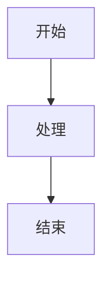

# Markdown 格式规范

## 核心原则

**强制执行**: 所有Markdown语法错误必须修复，确保文章能正确渲染。

## Markdown语法强制检查清单

### 1. 代码块完整性 (最高优先级)

**规则**: 每个\`\`\`开始必须有对应的\`\`\`结束

❌ **错误示例**:

````markdown
这是一段文字

```java
public class Example {
    // 代码
}
// 缺少结束标记！

继续其他内容
```
````

✅ **正确示例**:

````markdown
这是一段文字

```java
public class Example {
    // 代码
}
```
````

继续其他内容

```

**检查要点**:
- 统计\`\`\`的数量，必须是偶数
- 每个开始标记后必须有结束标记
- 不允许孤立的闭合标签

### 2. 代码块语言标识

**规则**: 所有代码块必须指定语言

❌ **错误**:
~~~markdown
```

代码内容

````
~~~

✅ **正确**:
~~~markdown
```java
代码内容
````

````

**常用语言标识**:
- `java` - Java代码
- `python` - Python代码
- `javascript` / `js` - JavaScript代码
- `typescript` / `ts` - TypeScript代码
- `bash` / `shell` - Shell脚本
- `sql` - SQL语句
- `yaml` / `yml` - YAML配置
- `json` - JSON数据
- `markdown` / `md` - Markdown文本
- `mermaid` - Mermaid图表
- `plantuml` - PlantUML图表

### 3. 列表格式

**规则**: 列表前后必须有空行

❌ **错误**:
```markdown
前面段落
- 列表项1
- 列表项2
后面段落
```

✅ **正确**:
```markdown
前面段落

- 列表项1
- 列表项2

后面段落
```

**嵌套列表**:
```markdown
- 一级列表项
  - 二级列表项
  - 二级列表项
- 一级列表项
```

**有序列表**:
```markdown
1. 第一项
2. 第二项
3. 第三项
```

### 4. 标题层级

**规则**: 严格按层级递增，不跳级

❌ **错误**:
```markdown
# 一级标题
### 三级标题 (跳过了二级)
```

✅ **正确**:
```markdown
# 一级标题
## 二级标题
### 三级标题
```

**标题规范**:
- 标题前后各留一个空行
- 标题后不要有冒号（除非是特殊格式需要）
- 标题使用中文时，中英文之间加空格

### 5. 文件结尾

**规则**: 文件必须以单个换行符结束

❌ **错误**:
- 文件结尾没有换行符
- 文件结尾有多个换行符

✅ **正确**:
- 文件结尾恰好有一个换行符

### 6. 加粗和斜体

**加粗**:
```markdown
**粗体文本**
```

**斜体**:
```markdown
*斜体文本*
```

**加粗+斜体**:
```markdown
***粗斜体文本***
```

**注意事项**:
- 中英文混排时，符号紧贴英文，中文前后加空格
- 例如：这是 **important** 的内容

### 7. 链接和图片

**链接**:
```markdown
[链接文本](https://example.com)
```

**图片**:
```markdown

```

**引用式链接**:
```markdown
[链接文本][ref]

[ref]: https://example.com
```

### 8. 引用块

```markdown
> 这是引用的内容
> 可以多行

> **产品标识口号**: "不积跬步无以至千里"
```

### 9. 表格

```markdown
| 列1 | 列2 | 列3 |
|-----|-----|-----|
| 数据1 | 数据2 | 数据3 |
| 数据4 | 数据5 | 数据6 |
```

**对齐**:
```markdown
| 左对齐 | 居中 | 右对齐 |
|:-------|:----:|-------:|
| 内容   | 内容  |   内容 |
```

## 特殊格式

### Mermaid 图表



**常用图表类型**:
- `graph` - 流程图
- `sequenceDiagram` - 时序图
- `classDiagram` - 类图
- `stateDiagram` - 状态图
- `erDiagram` - 实体关系图

### 代码块内的注释

```java
// 单行注释

/*
 * 多行注释
 * 说明代码逻辑
 */

/**
 * JavaDoc注释
 * @param name 参数说明
 * @return 返回值说明
 */
```

## 禁止的错误

### 1. 嵌套代码块

❌ **绝对禁止**:
~~~markdown
```markdown
正确格式：
```java
代码内容
```
```
````

这会导致渲染错误！

✅ **正确做法**: 使用不同的分隔符

````markdown
````markdown
正确格式：

```java
代码内容
```
````

```

```
````

### 2. 列表缩进错误

❌ **错误**:

```markdown
- 项目1
- 项目2 (缩进不一致)
```

✅ **正确**:

```markdown
- 项目1
  - 项目2 (2个空格或1个tab)
```

### 3. 标题格式错误

❌ **错误**:

```markdown
#标题 (缺少空格)

## 标题： (不必要的冒号)
```

✅ **正确**:

```markdown
# 标题

## 标题
```

## 自动检查流程

### 编写完成后的检查步骤

1. **代码块配对检查**

   ````bash
   # 统计```数量
   grep -o '```' article.md | wc -l
   # 结果必须是偶数
   ````

2. **语言标识检查**

   ````bash
   # 查找没有语言标识的代码块
   grep -n '^```$' article.md
   # 应该没有匹配结果
   ````

3. **列表格式检查**
   - 查看列表前后是否有空行
   - 检查嵌套缩进是否一致

4. **标题层级检查**
   - 从上到下检查标题层级是否连续
   - 不应出现跳级

5. **运行linter工具**
   ```bash
   markdownlint article.md
   ```

## 修复常见错误

### 错误1：代码块未闭合

**症状**: 文章后半部分全部显示为代码

**修复**:

1. 从错误位置往前查找最近的\`\`\`
2. 确认是否缺少结束标记
3. 添加对应的\`\`\`

### 错误2：列表渲染异常

**症状**: 列表显示为普通文本

**修复**:

1. 在列表前添加空行
2. 在列表后添加空行
3. 检查缩进是否一致

### 错误3：标题不显示

**症状**: 标题显示为普通文本

**修复**:

1. 确保#后有空格
2. 检查前后是否有空行
3. 验证标题层级是否正确

## 质量保证

### 渲染测试

生成文章后，必须：

1. 在Markdown编辑器中预览
2. 检查所有格式是否正常
3. 验证代码块是否正确显示
4. 确认图表是否渲染

### 错误修复优先级

1. **Critical**: 代码块未闭合 → 立即修复
2. **High**: 列表格式错误 → 优先修复
3. **Medium**: 标题层级错误 → 应该修复
4. **Low**: 空行不规范 → 建议修复

## 最佳实践

### 代码块最佳实践

1. **始终指定语言**
2. **保持代码简洁**
3. **添加必要注释**
4. **确保代码可运行**

### 图表最佳实践

1. **使用Mermaid绘制关系图**
2. **保持图表简洁清晰**
3. **避免过于复杂的图表**
4. **图表要能自解释**

### 格式一致性

1. **统一使用空行分隔段落**
2. **统一列表缩进（2空格）**
3. **统一代码块语言标识风格**
4. **统一链接引用方式**
