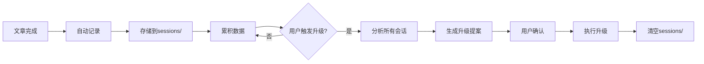
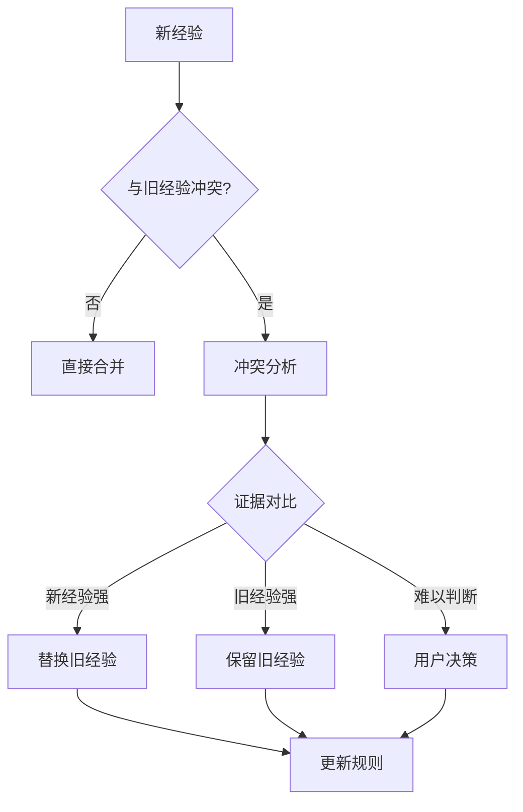
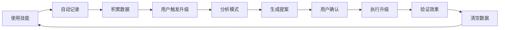

# 双记忆系统说明

## 系统概述

双记忆系统由短期记忆（会话记录）和长期记忆（规则演进）组成，支持技能的持续学习和优化。

## 短期记忆：会话记录

### 存储位置

```
.tech-article-writer/
├── sessions/                    # 会话记录存储
│   └── YYYY-MM-DD-HH-MM-article-session.json
├── images/                      # 生成的图片
│   └── YYYY-MM-DD-diagram-name.png
└── upgrades/                    # 升级记录
    ├── YYYY-MM-DD-upgrade-proposal.md
    └── backup-skills/           # 技能备份
```

### 会话记录结构

```json
{
  "session_id": "uuid-2024-01-15-14-30-tech-article",
  "timestamp": "2024-01-15T14:30:00+08:00",
  "article_type": "科普型|问题解决型|经验总结型|趋势分析型",
  "topic": "文章主题",
  "generation_details": {
    "structure_decisions": "结构设计决策",
    "content_choices": "内容选择理由",
    "example_selection": "示例选择依据"
  },
  "quality_metrics": {
    "accuracy_score": 0.95,
    "completeness": 0.9,
    "readability": 0.88,
    "engagement": 0.92
  },
  "user_feedback": {
    "explicit_feedback": "用户明确反馈",
    "corrections": ["修正1", "修正2"],
    "satisfaction_score": 9
  }
}
```

### 自动记录触发

**触发时机**：

- 文章创作完成
- 用户接受修改
- 用户提供反馈

**记录内容**：

1. 基本元数据（时间、主题、类型）
2. 生成决策过程
3. 质量评估指标
4. 用户反馈和修正
5. 效果评估

### 记录生命周期



## 长期记忆：规则演进

### 升级触发命令

用户可以输入以下命令触发智能升级：

```
升级技能
分析文章生成模式
复盘文章会话记录
检查生成效果
优化技能配置
```

⚠️ **注意**：本技能的升级是针对技能本身的优化（脚本、参考文档、模板等），而非提示词优化。

### 升级流程

#### 1. 数据收集阶段

```python
# 扫描所有会话记录
sessions = scan_sessions(".tech-article-writer/sessions/")

# 验证数据完整性
validate_sessions(sessions)

# 最少需要3个会话
if len(sessions) < 3:
    print("需要至少3个会话记录才能进行升级分析")
    exit()
```

#### 2. 模式分析阶段

**分析维度**：

1. **文章结构效果分析**
   - 哪种结构用户满意度最高
   - 哪些段落经常需要修改
   - 长度控制的最优范围

2. **技术准确性分析**
   - 技术概念解释的准确性
   - 代码示例的质量
   - 引用权威性

3. **用户偏好挖掘**
   - 喜欢的写作风格
   - 常用的技术类型
   - 修改的高频点

4. **效率瓶颈识别**
   - 生成时间较长的部分
   - 经常出错的环节
   - 需要多次迭代的内容

#### 3. 洞察提取阶段

```yaml
insight_extraction:
  successful_patterns:
    - 高质量文章的共同特征
    - 用户满意度高的内容组织方式
    - 有效的技术解释方法

  failure_patterns:
    - 导致用户不满的因素
    - 常见的技术错误
    - 结构设计的问题

  optimization_opportunities:
    - 可以改进的地方
    - 可以自动化的环节
    - 可以增强的能力
```

#### 4. 提案生成阶段

生成结构化的升级提案：

```markdown
# 技术文章写作技能升级提案

## 执行摘要

基于X个会话的分析，识别出以下关键洞察...

⚠️ **升级范围说明**：

- ✅ 脚本优化（提升生成质量、效率）
- ✅ 参考文档更新（写作规范、模板改进）
- ✅ 质量检查标准调整
- ✅ 资源文件优化（模板、示例）
- ❌ 不涉及提示词修改（这是技能本身，非提示词）

## 详细分析

### 1. 文章结构效果

- 发现：科普型文章使用类比后满意度提升40%
- 建议：强化类比的使用，提供类比设计指南

### 2. 技术准确性

- 发现：代码示例未测试导致20%的修正
- 建议：所有代码示例必须可运行

### 3. 用户偏好

- 发现：用户偏好简洁的总结
- 建议：优化总结部分的生成逻辑

## 提议变更

### 变更1：强化类比设计

**当前**：类比使用随机
**提议**：提供系统的类比设计方法
**影响**：提升文章易读性

### 变更2：代码示例验证

**当前**：代码示例未强制验证
**提议**：所有代码必须可运行
**影响**：提升技术准确性

## 实施计划

1. 备份当前规则
2. 应用变更1
3. 验证效果
4. 应用变更2
5. 最终验证

## 风险评估

- 变更1：低风险，易于实施
- 变更2：中风险，需要测试环境
```

#### 5. 用户确认阶段

**必须**等待用户明确确认：

- ✅ "批准"
- ✅ "同意"
- ✅ "执行"
- ❌ "继续"（模糊，不算确认）
- ❌ "好的"（模糊，不算确认）

#### 6. 执行升级阶段

```python
# 1. 备份当前技能文件
backup_current_skill()

# 2. 按优先级应用变更
for change in sorted_changes:
    apply_change(change)
    validate_change(change)
    if validation_failed:
        rollback()
        break

# 3. 验证整体效果
if validate_overall():
    # 4. 清空会话记录
    cleanup_sessions()
    # 5. 生成升级报告
    generate_upgrade_report()
else:
    # 回滚
    rollback_to_backup()
```

## 记忆融合机制

### 冲突检测

```yaml
conflict_detection:
  similarity_check:
    - 识别相似的经验
    - 检测矛盾的建议
    - 评估证据强度

  conflict_types:
    - 直接冲突：新旧经验直接矛盾
    - 优先级冲突：不同场景下的优先级差异
    - 适用性冲突：特定场景适用性不同
```

### 冲突解决策略

1. **证据优先**：证据更强的经验优先
2. **时效性权重**：新经验获得时间权重
3. **场景考虑**：考虑不同文章类型的特殊性
4. **用户偏好**：结合用户反馈决策

### 融合策略



## 质量保障

### 验证标准

升级后必须满足：

1. **功能完整性**：所有原有功能正常
2. **质量提升**：文章生成质量提升≥10%
3. **用户满意度**：满意度≥4.5/5.0
4. **错误率降低**：修正次数降低≥15%

### 回滚机制

**触发条件**：

- 验证失败
- 质量下降
- 用户要求
- 发现严重问题

**回滚流程**：

1. 从备份恢复规则
2. 清理临时文件
3. 生成回滚报告
4. 分析失败原因

## 持续优化

### 监控指标

```yaml
monitoring_metrics:
  quality_metrics:
    - 文章准确性评分
    - 用户满意度趋势
    - 修正频率变化
    - 生成效率提升

  user_feedback:
    - 反馈情感分析
    - 常见问题识别
    - 改进建议收集
    - 满意度追踪

  system_performance:
    - 生成时间
    - 迭代次数
    - 成功率
    - 错误率
```

### 优化循环



## 最佳实践

### 使用建议

1. **定期升级**：积累10-20个会话后触发升级
2. **及时反馈**：使用过程中及时提供反馈
3. **记录详细**：修改原因和效果要详细
4. **验证效果**：升级后要验证实际效果

### 注意事项

1. **数据质量**：确保会话记录准确完整
2. **隐私保护**：敏感内容不记录
3. **增量更新**：避免大幅度调整
4. **安全保障**：随时可以回滚

## 技术实现

### 会话记录脚本

```python
# scripts/record_session.py
def record_session(article_file, metadata):
    session = {
        "session_id": generate_uuid(),
        "timestamp": get_timestamp(),
        "article_type": metadata["type"],
        "quality_metrics": calculate_metrics(article_file),
        "user_feedback": metadata["feedback"]
    }
    save_session(session)
```

### 模式分析脚本

```python
# scripts/analyze_patterns.py
def analyze_patterns(sessions):
    patterns = {
        "structure_effectiveness": analyze_structure(sessions),
        "content_quality": analyze_quality(sessions),
        "user_preferences": analyze_preferences(sessions)
    }
    return patterns
```

### 升级执行脚本

```python
# scripts/execute_upgrade.py
def execute_upgrade(proposal, confirmed):
    if not confirmed:
        return False

    backup_rules()
    for change in proposal.changes:
        apply_change(change)
        if not validate(change):
            rollback()
            return False

    cleanup_sessions()
    return True
```
