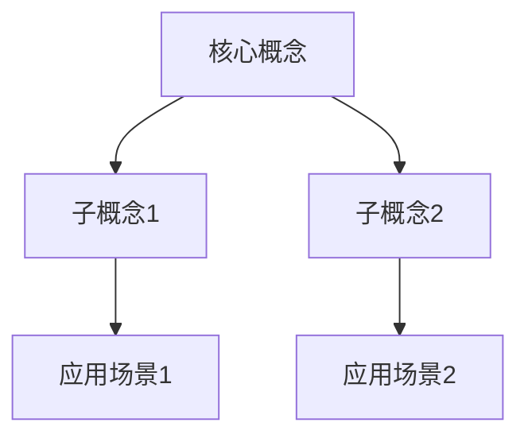

# 技术文章写作规范

## 内容类型识别与差异化写作

### 1. 技术概念科普型

**适用场景**: 新技术介绍、概念解释、基础知识普及

**结构特点**:

- 场景引入：用生动的现实场景引出问题
- 概念引出：自然引出技术概念
- 深度阐释：清晰定义和解释
- 应用示例：多维度实例
- 总结回顾：知识图谱+精华提炼

**写作重点**:

- 类比生动：将技术概念与生活常识对比
- 层次清晰：从简单到复杂逐步深入
- 循序渐进：每个概念建立在前一个基础上

### 2. 问题解决型

**适用场景**: 技术难题分析、最佳实践分享、故障排查

**结构特点**:

- 场景引入：呈现真实技术痛点
- 破俗立新：挑战常见认知误区
- 方案对比：展示不同解决方案
- 深度分析：详细分析最佳方案
- 总结回顾：关键要点提炼

**写作重点**:

- 问题尖锐：直击痛点，引发共鸣
- 方案对比：清晰对比优劣
- 实用性强：提供可操作的解决方案

### 3. 经验总结型

**适用场景**: 项目复盘、技术选型、架构设计

**结构特点**:

- 场景引入：项目背景介绍
- 背景分析：问题和挑战
- 过程复盘：决策过程和实施
- 经验提炼：可复用的经验
- 总结回顾：关键经验提炼

**写作重点**:

- 真实案例：基于真实项目经验
- 深度思考：不止步于表面
- 可复制性：经验可被借鉴

### 4. 趋势分析型

**适用场景**: 技术趋势、行业分析、未来预测

**结构特点**:

- 场景引入：行业现状描述
- 现状分析：当前技术状态
- 趋势解读：未来发展方向
- 影响评估：对行业的影响
- 总结回顾：核心洞察

**写作重点**:

- 数据支撑：用数据说话
- 逻辑严密：推理过程清晰
- 前瞻性强：有独到见解

## 黄金五段式结构

### 第一段：场景引入 (10%)

**目的**: 用生动的现实场景引出问题，激发读者兴趣

**技巧**:

- 提问悬疑：以问题开头，引发思考
- 技术幽默：用轻松的方式切入主题
- 案例关联：讲述一个真实场景
- 开门见山：直接点明主题价值

**禁忌**:

- 避免抽象概念堆砌
- 避免冗长的背景介绍
- 避免偏离主题的铺垫

### 第二段：概念引出/破俗立新 (15%)

**科普型文章**：

- 自然引出核心技术概念
- 给出简明的定义
- 说明为什么需要这个技术

**问题解决型文章**：

- 挑战常见的认知误区
- 指出传统方法的不足
- 为新方法做铺垫

**技巧**:

- 使用对比突出差异
- 用数据支撑观点
- 引用权威说法

### 第三段：深度阐释 (20%)

**目的**: 深入解释核心概念或方案

**内容包含**:

- 技术原理的详细说明
- 关键概念的拆解
- 核心机制的工作流程
- Mermaid/PlantUML图表辅助理解

**写作要求**:

- 认知台阶：按照"听讲逻辑"展开
- 逻辑链条：事实+推理
- 视觉辅助：至少1个流程图或架构图

### 第四段：举一反三 (45%)

**目的**: 通过多个实例深化理解

**内容结构**:

- 基础应用示例（简单场景）
- 进阶应用示例（复杂场景）
- 综合应用示例（实战场景）
- 对比分析（与其他方案对比）

**要求**:

- 3-5个具体代码示例
- 代码可运行
- 注释完整
- 由浅入深

**技巧**:

- 贯穿全文的核心类比
- 前后对比（使用前后）
- 方案对比（不同技术）
- 效果对比（具体数据）

### 第五段：总结回顾 (10%)

**必须包含**:

1. **知识图谱**：用Mermaid绘制核心概念关系图
2. **一句话精华**："如果今天你只记得一句话"
3. **延伸阅读**：3-5篇权威文章引用

**知识图谱示例**:



**一句话精华要求**:

- 高度概括核心价值
- 易于记忆和传播
- 体现文章独特洞察

## 写作技巧四大支柱

### 1. 认知台阶构建

**遵循"听讲逻辑"**：

- ❌ 演讲逻辑：先结论后论证（适合演讲）
- ✅ 听讲逻辑：先论证后结论（适合文章）

**线性思维展开**：

- 问题→原因→方案
- 现象→原理→应用
- 背景→分析→结论

**认知阶梯**：

- 每个概念建立在前一个基础上
- 无法否认的事实
- 无可辩驳的逻辑
- 适时的技术幽默

### 2. 画面感营造

**具体到细节**：

```python
❌ 抽象：这个算法很高效
✅ 具体：这个算法将查询时间从500ms降低到50ms，性能提升10倍
```

**善用类比**：

```
微服务架构就像城市的功能分区：
- 居住区（用户服务）
- 商业区（订单服务）
- 工业区（数据处理服务）
每个区域独立运作，通过道路（API）连接
```

**点睛排比**：

```
好的架构设计：
- 让系统易于扩展
- 让代码易于维护
- 让团队易于协作
```

### 3. 精彩开场与有力结尾

**开场四法**：

1. **提问悬疑**：

   > 为什么有些系统能轻松应对百万QPS，而有些系统在千级QPS就开始卡顿？

2. **技术幽默**：

   > 程序员的三大谎言：注释写得很清楚、这个bug下周就修、代码肯定没问题。今天我们聊聊第一个。

3. **案例关联**：

   > 2020年某电商大促，系统突然崩溃，损失上千万。事后发现，原因竟然是一个缓存配置问题。

4. **开门见山**：
   > Redis不仅仅是缓存，它是构建高性能系统的瑞士军刀。

**结尾金句**：

- 用一句话概括核心价值
- 给读者留下深刻印象
- 余音绕梁的效果

### 4. 批判思维与事实检验

**对用户输入保持客观**：

- 不盲目接受用户的技术判断
- 主动检索验证技术信息
- 给出平衡、客观的分析

**事实检验**：

- 代码示例必须可运行
- 技术概念引用权威文档
- 数据对比基于真实测试
- 方案优劣有充分论据

## 产品化规范

### 标准文章抬头

```markdown
# 文章标题

**文 | 三七** （转载请注明出处）  
**公众号：三七-编程实战**

### 🎨 封面图片提示词

[自动生成，单独文件]

> **不积跬步无以至千里，欢迎来到AI时代的编码实战课**

## 📝 文章摘要

[自动生成，单独文件]
```

### 必备元素清单

- ✅ 标准文章抬头
- ✅ 产品口号
- ✅ 封面图片提示词（独立文件）
- ✅ 文章摘要（独立文件）
- ✅ 完整的五段式结构
- ✅ 至少1个Mermaid/PlantUML图表
- ✅ 3-5个代码示例
- ✅ 知识图谱
- ✅ 一句话精华
- ✅ 3-5篇延伸阅读

### 质量控制标准

- 🎯 阅读时长8-12分钟
- 🎯 技术深度适中
- 🎯 逻辑链条清晰
- 🎯 代码可运行
- 🎯 语言生动有趣
- 🎯 格式规范正确
- 🎯 类比贯穿全文
- 🎯 对比效果明显

## 整篇重新生成机制

**触发条件**：

- 用户提出任何修改要求
- 局部内容调整
- 增加或删除章节
- 修改技术细节

**重新生成内容**：

1. 重新检查全文逻辑一致性
2. 重新生成总结部分
3. 重新生成知识图谱
4. 重新生成"一句话精华"
5. 更新封面图片提示词（如主题变化）
6. 更新文章摘要

**禁止行为**：

- ❌ 仅修改局部不检查全文
- ❌ 保留与修改内容矛盾的段落
- ❌ 总结与正文不一致
- ❌ 知识图谱未更新

**执行步骤**：

1. 应用用户的修改要求
2. 从头到尾重新审视文章
3. 调整不一致的地方
4. 重新生成总结和精华
5. 运行质量检查脚本
6. 重新生成独立文件
